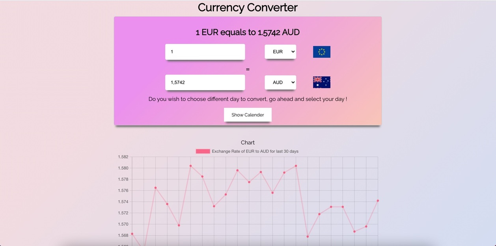

<h1 align="center">React Currency Converter</h1>

<h1 align="center">
	
</h1>
<h3 align="center">A web-based application to convert amount from one currency to another currency with some added features.
</h3>

---
## Features
- Ability to select the source and target currencies
- Ability to input the source amount
- Option to select a different date in the past for the conversion rate
- Bidirectional conversion (user can input either source or target amount)
- Historical evolution of exchange rate over a period of last month in a chart

## Tools & Technologies
- React JS
- Axios
- Moment.js
- [React-Chartjs-2](https://reactchartjs.github.io/react-chartjs-2/#/)
- [Frankfurter API](https://www.frankfurter.app/)
  - Motivation behind using this API
    - There are many APIs available which provide exchange rates. But they do not allow switching Base currencies in the free plan. Frankfurter API does provide the Base currency switching which is the most important requirement of this project.
- [Currency-flags package](https://github.com/transferwise/currency-flags)

## Setup
Clone this repo to your desktop and run `npm install` to install all the dependencies.

---

## Usage
After you clone this repo to your desktop, go to its root directory and run `npm install` to install its dependencies.

Once the dependencies are installed, you can run  `npm start` to start the application. You will then be able to access it at localhost:3000

---

## Future scope

- Ability to perform multiple conversions at the same time 
